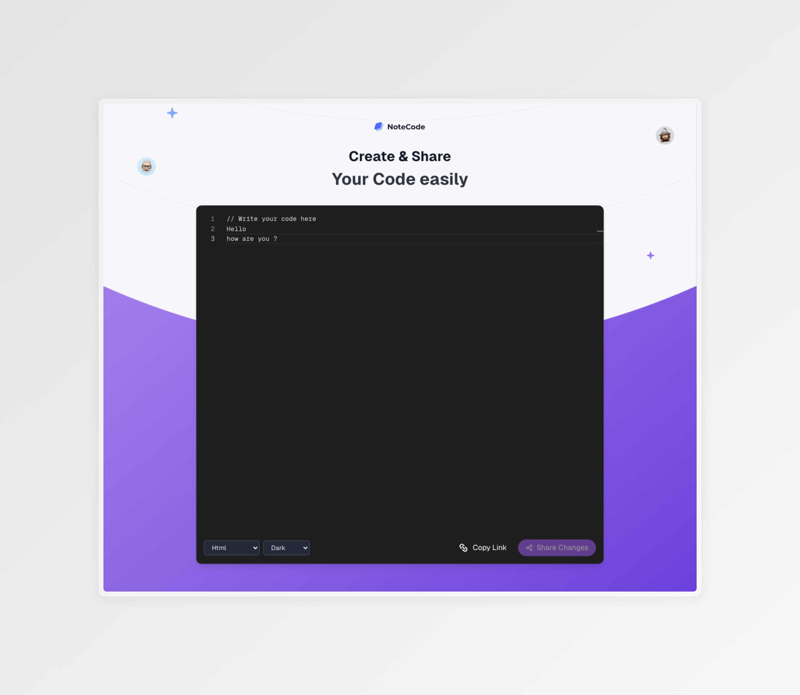

# NoteCode - Code Sharing Application

A modern, real-time code sharing application built with Next.js that allows developers to easily share and collaborate on code snippets.

> 🤖 This project was primarily developed through prompting with [Cursor AI](https://cursor.sh/), demonstrating the power of AI-assisted development while maintaining high code quality and best practices.

## Features

- 🎨 Clean and modern UI with dark/light mode support
- 📝 Real-time code editing with Monaco Editor
- 🔄 Multiple programming language support
- 🔗 Shareable session links
- 🎯 Responsive design

## Tech Stack

- **Frontend:**
  - Next.js
  - React
  - Monaco Editor
  - TailwindCSS
  - Outfit Font

- **Backend:**
  - Next.js API Routes
  - Prisma
  - PostgreSQL

- **Development Tools:**
  - Cursor AI (Primary development assistant)

## Getting Started

### Prerequisites

- Node.js (v14 or higher)
- npm or yarn
- PostgreSQL database

### Installation

1. Clone the repository:

```bash
git clone https://github.com/yourusername/code-sharing-app.git
cd code-sharing-app
```

2. Install dependencies:

```bash
npm install
# or
yarn install
```

3. Set up environment variables:
   - Copy `.env.example` to `.env`
   - Update the values in `.env` with your configuration

```bash
cp .env.example .env
```

4. Set up the database:

```bash
npx prisma migrate dev
```

5. Run the development server:

```bash
npm run dev
# or
yarn dev
```

6. Open [http://localhost:3000](http://localhost:3000) in your browser.

## Security Considerations

### Environment Variables
- Never commit `.env` files to the repository
- Use `.env.example` as a template for required variables
- Keep sensitive credentials secure
- Use strong database passwords in production

### Database
- Use strong passwords
- Limit database access to necessary IP addresses
- Regularly backup your database
- Keep Prisma and other dependencies updated

### Production Deployment
- Use HTTPS in production
- Set up proper CORS policies
- Enable rate limiting for API routes
- Keep all dependencies updated
- Follow security best practices for your hosting platform

## Project Structure

```
code-sharing-app/
├── src/
│   ├── components/      # React components
│   ├── hooks/          # Custom React hooks
│   ├── pages/          # Next.js pages
│   ├── config/         # Configuration files
│   └── styles/         # Global styles
├── prisma/             # Database schema and migrations
├── public/            # Static assets
└── package.json       # Project dependencies
```

## Key Components

- `CodeEditor`: Main editor component using Monaco Editor
- `EditorBottomBar`: Controls for language selection and sharing
- `Layout`: Main layout component with theme support
- `useEditor`: Hook for editor state management
- `useTheme`: Hook for theme management
- `useCollaboration`: Hook for real-time collaboration

## Development Approach

This project showcases a modern development workflow that combines human expertise with AI assistance:

- **AI-Assisted Development**: Leveraged Cursor AI for code generation, optimization, and problem-solving
- **Best Practices**: Maintained high code quality and modern development standards
- **Iterative Development**: Used AI prompts to refine and improve code incrementally
- **Clean Architecture**: Organized code structure and separation of concerns

## Acknowledgments

- [Cursor AI](https://cursor.sh/) - Primary development assistant
- [Monaco Editor](https://microsoft.github.io/monaco-editor/)
- [Next.js](https://nextjs.org/)
- [TailwindCSS](https://tailwindcss.com/)
- [Prisma](https://www.prisma.io/)
- [Outfit Font](https://fonts.google.com/specimen/Outfit)

---


